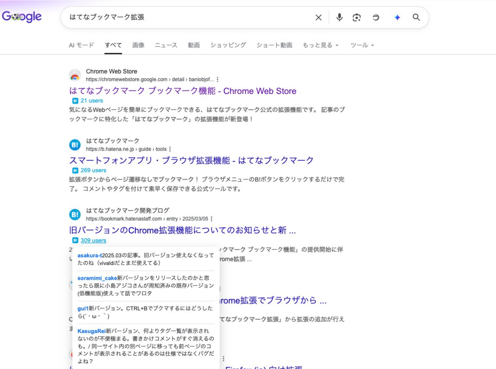

# GSearch With Social Signals

Google検索結果に、Hatena Bookmark 件数と Hacker News の最大スコアを小さなバッジで表示する Chrome 拡張です。

検索順位や検索結果の本文は変更しません。リンク先を開く前に、そのページが日本語圏・英語圏の技術コミュニティでどれくらい参照されているかを確認するための補助ツールです。



## できること

- Google検索結果のリンク付近に Hatena Bookmark 件数を `123 users` のように表示します。
- Hacker News で話題になったURLには、最も高い story score を `HN 456 pts` のように表示します。
- Hatena バッジにマウスを重ねる、またはキーボードフォーカスすると、コメント付きブックマークのプレビューを表示します。
- 0件、または正のスコアがない結果にはバッジを表示しません。
- Google検索の順位、タイトル、スニペット、広告枠は変更しません。

## こんなときに便利です

- 技術記事、ライブラリ、仕様、障害報告などを調べるときに、読む順番の手がかりが欲しい。
- 日本語圏では Hatena Bookmark、英語圏では Hacker News の反応を同じ検索結果上で見たい。
- 検索結果を開く前に、コミュニティでの注目度や議論の有無をざっと確認したい。

## 使い方

1. Chrome Web Store から拡張をインストールします。
2. 対応している Google 検索ページで検索します。
3. 検索結果の近くに表示される Hatena / HN バッジを確認します。
4. 詳細を見たい場合は、バッジをクリックして Hatena Bookmark または Hacker News のページを開きます。

Chrome Web Store 公開前に手動で試す場合は、このREADME下部の「手動で試す場合」を参照してください。

## 表示されるバッジ

### Hatena Bookmark

`123 users` のように表示されます。

- クリックすると Hatena Bookmark のエントリーページを開きます。
- マウスホバーまたはキーボードフォーカスで、コメント付きブックマークのプレビューを表示します。
- ブックマークが0件の場合は表示しません。

### Hacker News

`HN 456 pts` のように表示されます。

- Hacker News Search / Algolia で一致した story のうち、最も高い score を表示します。
- クリックすると、該当する Hacker News story または検索結果を開きます。
- 正の score が見つからない場合は表示しません。

## 対応している Google 検索

現在は以下の Google 検索結果ページに対応しています。

- `google.com`
- `google.co.jp`
- `google.co.uk`
- `google.co.in`
- `google.ca`
- `google.com.au`
- `google.com.hk`
- `google.com.sg`
- `google.com.tw`

対象は通常の検索結果ページです。Google の内部ページ、アカウント画面、設定画面、その他のサービス画面には注入しません。

対応してほしい Google 地域ドメインがある場合は、GitHub Issues から知らせてください。

## プライバシー

この拡張は、検索結果に表示されたURLのソーシャルシグナルを取得するために、そのURLを外部APIへ送信します。

送信先は以下です。

- Hatena Bookmark API
- Hacker News Search / Algolia API

開発者は独自のサーバーを運用せず、検索結果URL、検索語、閲覧履歴、Google アカウント情報を保存しません。拡張の処理に使う一時的なキャッシュはブラウザ内のメモリ上に置かれ、ページ遷移やブラウザの状態に応じて破棄されます。

詳細は [Privacy Policy](PRIVACY.md) を確認してください。

## 非公式拡張です

GSearch With Social Signals は非公式のプロジェクトです。Google、Hatena、Hacker News、Y Combinator、Algolia によって提供・承認・保証されているものではありません。

Google Search is a trademark of Google LLC. 各サービス名、ロゴ、商標はそれぞれの権利者に帰属します。

## 困ったとき

不具合や要望は [GitHub Issues](https://github.com/umiyosh/gsearch-social-signals/issues) に登録してください。

報告時に以下があると確認しやすくなります。

- 検索した Google ドメイン
- 検索語
- バッジが出なかった、または表示が崩れた検索結果URL
- Chrome のバージョン

## 手動で試す場合

通常の利用ではこの手順は不要です。Chrome Web Store 公開前の確認や、開発中の最新版を試す場合だけ使います。

```bash
npm install
npm run build
```

その後、Chrome の `chrome://extensions/` を開き、デベロッパーモードを有効にして `dist/` を「パッケージ化されていない拡張機能」として読み込みます。

配布用zipを作る場合は次を実行します。

```bash
make package
```

開発・公開作業の詳細は以下にあります。

- [実装仕様](docs/spec.md)
- [Hacker News 連携仕様](docs/spec_hn.md)
- [リリース管理](docs/release-management.md)
- [Chrome Web Store Privacy practices](docs/chrome-web-store-privacy-practices.md)
