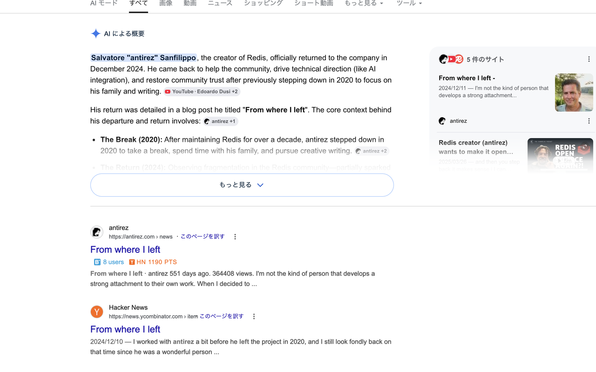

<h1>
   GSearch With Social Signals
</h1>

**Google と DuckDuckGo の検索結果に、Hatena Bookmark件数、Hacker News スコア、Bluesky URL mention countを表示する Chrome 拡張です。**

リンクを開く前に、そのページが日本語圏・英語圏の技術コミュニティでどれくらい参照されているかを確認できます。

[](https://github.com/umiyosh/gsearch-social-signals/actions/workflows/ci.yml)
[](./LICENSE)
[](https://chromewebstore.google.com/detail/gsearch-with-social-signa/kfllkjdhkdlffnibokeeajcmdkidcfng)

---

## 開く前にソーシャルシグナルを見る



## できること

- Google / DuckDuckGo の検索結果リンク付近に Hatena Bookmark 件数を `123 users` のように表示します。
- Hacker News で話題になったURLには、最も高い story score を `HN 456 pts` のように表示します。
- Bluesky で対象URLを含む投稿が見つかった場合、蝶アイコンの隣にURL mention countを `12 posts` のように表示します。
- Hatena バッジにマウスを重ねる、またはキーボードフォーカスすると、コメント付きブックマークのプレビューを表示します。
- 0件、または正のスコアがない結果にはバッジを表示しません。
- オプションを有効にすると、Hatena、HN、Bluesky のすべてに正のシグナルがない検索結果を非表示にできます。初期値は OFF です。
- 検索サービス側の順位、タイトル、スニペット、広告枠は変更しません。

## こんなときに便利です

- 技術記事、ライブラリ、仕様、障害報告などを調べるときに、読む順番の手がかりが欲しい。
- 日本語圏では Hatena Bookmark、英語圏では Hacker News の反応を同じ検索結果上で見たい。
- 検索結果を開く前に、コミュニティでの注目度や議論の有無をざっと確認したい。

## 使い方

1. [Chrome Web Store](https://chromewebstore.google.com/detail/gsearch-with-social-signa/kfllkjdhkdlffnibokeeajcmdkidcfng) から拡張をインストールします。
2. 対応している Google または DuckDuckGo のWeb検索ページで検索します。
3. 検索結果の近くに表示される Hatena / HN / Bluesky バッジを確認します。
4. 詳細を見たい場合は、バッジをクリックして各サービスのページを開きます。

Chrome Web Store 公開前に手動で試す場合は、このREADME下部の「手動で試す場合」を参照してください。

### ソーシャルシグナルがある結果だけを表示する

Chrome ツールバーの GSearch With Social Signals アイコンをクリックし、`Show only results with social signals` を有効にします。拡張機能メニューの「オプション」からも同じ設定を変更できます。Hatena Bookmark 件数、HN スコア、Bluesky URL mention count のいずれかが正の検索結果だけが残ります。

3サービスすべての API から正のシグナルがないと確認できた結果だけを非表示にします。API エラーなどで1サービスでも判定できない結果は表示したままにし、オプションを OFF に戻すと拡張機能が非表示にした結果を再表示します。

## 表示されるバッジ

### Hatena Bookmark

`123 users` のように表示されます。

- クリックすると Hatena Bookmark のエントリーページを開きます。
- マウスホバーまたはキーボードフォーカスで、コメント付きブックマークのプレビューを表示します。
- ブックマークが0件の場合は表示しません。

### Hacker News

`HN 456 pts` のように表示されます。

- Hacker News Search / Algolia で一致した story のうち、最も高い score を表示します。
- クリックすると、該当する Hacker News story または検索結果を開きます。
- 正の score が見つからない場合は表示しません。

### Bluesky

蝶アイコンと `12 posts` のような件数を表示します。

- 公開 AppView API が返す `hitsTotal` を、対象URLを含む投稿数の目安として表示します。likes、reposts、replies の合計ではありません。
- クリックすると、対象URLをqueryにしたBlueskyの検索結果を開きます。
- `hitsTotal` が0または取得不能の場合はバッジを表示しません。取得不能時はfilterをfail-openし、検索結果自体は表示します。

## 対応している検索

現在は以下の通常Web検索結果ページに対応しています。

- DuckDuckGo (`duckduckgo.com`)
- `google.com`
- `google.co.jp`
- `google.co.uk`
- `google.co.in`
- `google.ca`
- `google.com.au`
- `google.com.hk`
- `google.com.sg`
- `google.com.tw`

DuckDuckGo の画像・動画・ニュースなどWeb以外の検索タブは対象外です。広告、関連検索、検索サービスの内部導線にはバッジを付けません。

対応してほしい Google 地域ドメインがある場合は、GitHub Issues から知らせてください。

## プライバシー

この拡張は、検索結果に表示されたURLのソーシャルシグナルを取得するために、そのURLを外部APIへ送信します。

送信先は以下です。

- Hatena Bookmark API
- Hacker News Search / Algolia API
- Bluesky public AppView API

開発者は独自のサーバーを運用せず、検索結果URL、検索語、閲覧履歴、検索サービスのアカウント情報を保存しません。拡張の処理に使う一時的なキャッシュはブラウザ内のメモリ上に置かれ、ページ遷移やブラウザの状態に応じて破棄されます。フィルターの ON / OFF 設定だけを `chrome.storage.sync` に保存します。

詳細は [Privacy Policy](PRIVACY.md) を確認してください。

## 非公式拡張です

GSearch With Social Signals は非公式のプロジェクトです。Google、DuckDuckGo、Hatena、Hacker News、Y Combinator、Algolia、Bluesky によって提供・承認・保証されているものではありません。

Google Search is a trademark of Google LLC. DuckDuckGo および各サービス名、ロゴ、商標はそれぞれの権利者に帰属します。

## 困ったとき

不具合や要望は [GitHub Issues](https://github.com/umiyosh/gsearch-social-signals/issues) に登録してください。

よくある質問は [Support and FAQ](docs/support.md) にまとめています。

報告時に以下があると確認しやすくなります。

- 検索サービスとドメイン
- 検索語
- バッジが出なかった、または表示が崩れた検索結果URL
- Chrome のバージョン

## Live E2E 検証

このリポジトリには、実際の Google 検索結果ページで表示確認を行うための任意の Codex エージェントスキルがあります。

Google 検索はクリーンな自動実行環境では bot detection や CAPTCHA を返すことがあるため、この検証は意図的に CI には含めていません。

詳しくは [Live E2E 検証](docs/live-e2e.md) を確認してください。

## 手動で試す場合

通常の利用ではこの手順は不要です。Chrome Web Store 公開前の確認や、開発中の最新版を試す場合だけ使います。

```bash
npm install
npm run build
```

その後、Chrome の `chrome://extensions/` を開き、デベロッパーモードを有効にして `dist/` を「パッケージ化されていない拡張機能」として読み込みます。

配布用zipを作る場合は次を実行します。

```bash
make package
```

開発・公開作業の詳細は以下にあります。

- [実装仕様](docs/spec.md)
- [診断ビルド](docs/diagnostics.md)
- [Hacker News 連携仕様](docs/spec_hn.md)
- [Bluesky 連携仕様](docs/spec_bluesky.md)
- [リリース管理](docs/release-management.md)
- [Support and FAQ](docs/support.md)
- [運用手順](docs/operations.md)
- [Chrome Web Store Privacy practices](docs/chrome-web-store-privacy-practices.md)
